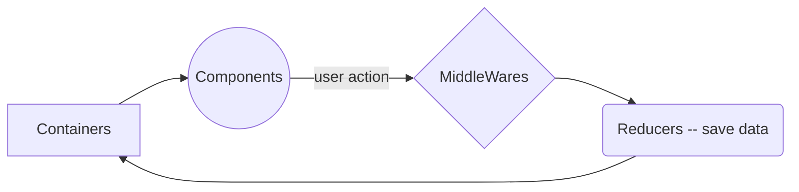

# Welcome to MovieTonight!

Hi! I'm trying to learn React Native with this project, it's my 1st App.

# Purpose

- Search for a movie and add it your **favorite**, **already watched** or **to watch movies** lists.
- Each Day the application will recommend you 4 movies to watch. (coming in few week)

## Api
To fetch films informations, i'm using [www.themoviedb](https://www.themoviedb.org/) v3
Maybe in the future i will switch to [omdb Api](https://www.omdbapi.com/)

## Navigation

I'm using [https://reactnavigation.org/](https://reactnavigation.org/) V5

> **Note:** The **V5** is a little bit tricky with component**s** render.

## Redux
I'm using REDUX to store my data, it's work like this.
Maybe move the input change in useState Hook, dont know...

# Expo
If you are using exo please use **expo install** instead of yarn or npm

### Exit CRNA  (Create-React-Native-App)

i will try to stay a long time with natif expo before switching and add specific feature for Android or iOS.
this will be one of my last step.

# Synchronization

NO BACKEND available yet

## LocalStorage

Sure, i will implement this before any backend to save my data in the cloud, this could be a mindblowing feature but we need this.

# Animations

Animated, Reanimated, or Reanimated 2 ?
the Reanimated 2 release date is close, i think i will wait for it and go in to play with :)

## Images
I go for SVG instead of png...

